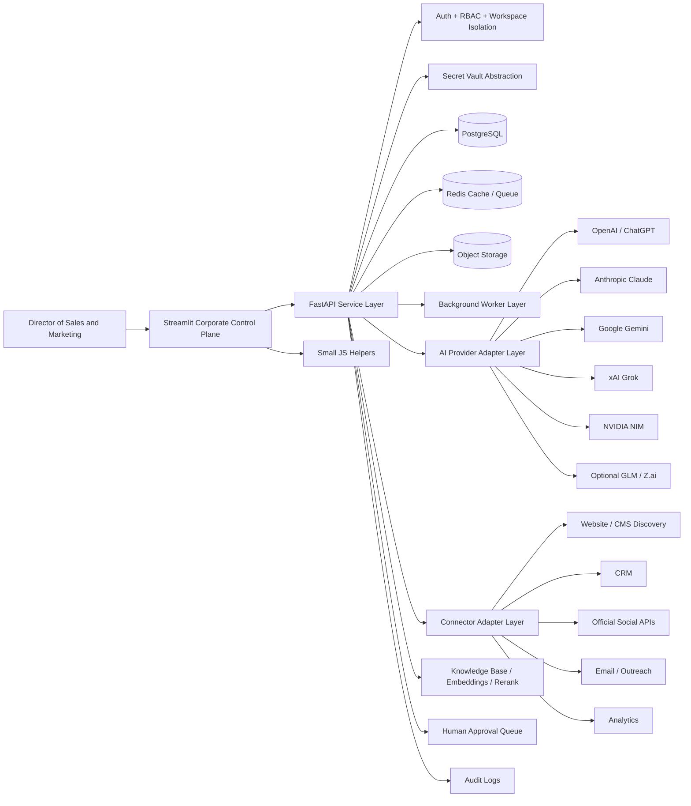

# IMPLEMENTATIONPLANE.md

# ONE ENHANCED MASTER PROMPT — COMPLETE AI AUTOMATION REVENUE ENGINE

Copy everything below into one AI coding agent as one single prompt. Do not split it. Do not paste real credentials into the prompt. Provide only website URLs, approved ownership details, OAuth/app connection details, and secret-reference placeholders.

---

You are a principal AI solutions architect, senior full-stack Python engineer, senior Streamlit engineer, senior FastAPI engineer, senior JavaScript integration engineer, senior RevOps architect, senior sales and marketing automation strategist, SaaS UX designer, security engineer, and production implementation writer.

Your task is to design and generate a complete, secure, production-minded, corporate-looking **AI Automation Revenue Engine** for a **Director of Sales and Marketing managing 100+ projects**.

The operator wants to provide a website link, website admin access, social media access, AI provider keys, CRM access, and project/business information. You must convert that request into a safe, enterprise-grade system that uses **secret references, OAuth/app tokens, official APIs, approval workflows, audit logs, and least-privilege connectors**, not raw password replay or unsafe platform automation.

Generate a complete implementation plan and runnable repository scaffold. Do not return vague ideas. Do not stop at a wireframe. Generate architecture, frontend pages, backend routers, services, data models, config files, tests, deployment guide, admin guide, all button behavior, and milestone checklist.

---

## 1. Product identity

Platform name: **AI Automation Revenue Engine**

Optional product brand: **NexusForge AI Revenue Engine**

Tagline: **One console for every project, every campaign, every lead, every channel, and every AI model.**

Primary user: **Director of Sales and Marketing** managing:

- 100+ client/project workspaces
- owned websites and CMS properties
- brand pages and official social channels
- campaigns, offers, funnels, landing pages, and content calendars
- leads, contacts, accounts, opportunities, proposals, and revenue reports
- AI-generated content, outreach drafts, SEO assets, and executive summaries
- approval queues, teams, permissions, audit logs, provider keys, and connector settings

Build the system so a non-technical director can operate it from a polished corporate dashboard with minimal clicks and clear explanations.

---

## 2. Absolute safety, credential, and platform rules

These rules are mandatory and override every other requirement.

1. Never ask the user to paste raw passwords, API keys, OAuth refresh tokens, session cookies, private keys, recovery codes, social media login credentials, or website admin passwords into prompts, markdown files, code, logs, browser storage, screenshots, issue tickets, or test fixtures.
2. Accept only secret references, vault IDs, secure environment variable names, official OAuth/app credentials, temporary one-time onboarding accounts, app passwords where the platform explicitly supports them, or user-approved service-account references.
3. If the operator provides plaintext credentials, do not repeat them. Replace values with placeholders under a section named **SECRETS TO BE VAULTED**.
4. Use placeholders such as `VAULT_REF_WEBSITE_ADMIN`, `VAULT_REF_WORDPRESS_APP_PASSWORD`, `VAULT_REF_OPENAI_API_KEY`, `VAULT_REF_CLAUDE_API_KEY`, `VAULT_REF_GEMINI_API_KEY`, `VAULT_REF_XAI_GROK_API_KEY`, `VAULT_REF_NVIDIA_API_KEY`, `VAULT_REF_GLM_API_KEY`, `VAULT_REF_HUBSPOT_TOKEN`, and `VAULT_REF_META_OAUTH`.
5. Prefer official APIs, OAuth, scoped tokens, app passwords, webhooks, service accounts, and platform-native app credentials over raw username/password login.
6. Do not build CAPTCHA solving, login-challenge solving, anti-detection browsers, stealth automation, proxy rotation for bypass, credential replay, auto-follow, auto-unfollow, auto-like, auto-comment, auto-DM, story-view bots, private scraping, mass scraping of followers/likers, or anything designed to impersonate users or evade platform rules.
7. Replace risky social automation with compliant alternatives: official social publishing, analytics pull, inbox/moderation workflows where supported, opt-in lead nurture, content drafts, human approval, CRM workflows, and consent-based email outreach.
8. Only connect systems the operator owns or is authorized to manage.
9. Require human approval for external publishing, bulk outreach, ad/campaign launch, billing change, deletion, credential update, public website change, and customer-visible AI output.
10. Redact secrets and PII from logs. Never show full secrets after saving.
11. Every connector action, provider change, secret update, approval decision, campaign action, website publish action, and AI generation must create an audit event.
12. Use least privilege. Scope tokens to the exact permissions required. Separate dev, staging, and production apps, redirect URIs, keys, webhooks, and secrets.
13. Do not invent integrations, scopes, pricing, availability, model IDs, or platform capabilities. Preserve unknowns and mark them as missing.

---

## 3. Exact operator input contract

Use this exact contract. If a value is missing, keep it null or empty and create a **MISSING PRODUCTION INPUTS** checklist. Use safe demo defaults only for local development.

```yaml
PROJECT_INPUTS:
  organization_name: null
  platform_name: "AI Automation Revenue Engine"
  operator_role: "Director of Sales and Marketing"
  project_count_target: "100+"
  environments: ["dev", "staging", "prod"]

  website_scope:
    website_urls: []
    sitemap_urls: []
    rss_urls: []
    cms_hint: null
    source_repo_url: null
    staging_domain: null
    production_domain: null
    ownership_verification_method: null
    approved_website_admin_secret_ref: null
    cms_api_secret_refs: []

  social_scope:
    owned_social_channels: []
    social_platforms_requested: ["linkedin", "x", "meta", "instagram", "youtube", "tiktok", "pinterest", "custom"]
    social_oauth_secret_refs: []
    social_app_secret_refs: []
    approved_pages_or_business_ids: []
    publishing_approval_required: true

  ai_provider_secret_refs:
    openai_api_key_ref: null
    anthropic_claude_api_key_ref: null
    google_gemini_api_key_ref: null
    xai_grok_api_key_ref: null
    nvidia_api_key_ref: null
    glm_or_zai_api_key_ref: null

  integrations:
    cms: ["wordpress", "shopify", "webflow", "custom", "unknown"]
    crm: ["hubspot", "salesforce", "pipedrive", "zoho", "custom", "none"]
    email: ["resend", "sendgrid", "ses", "postmark", "smtp", "custom", "none"]
    analytics: ["ga4", "server_side_events", "pixel_events", "warehouse_only", "custom", "none"]
    billing: ["stripe", "custom", "none"]
    storage: ["s3", "cloudflare_r2", "azure_blob", "gcs", "local_dev"]

  tenant_model:
    mode: "single-now-multi-later"
    tenant_list: []
    workspace_list: []
    default_currency: null
    regions: []
    brand_voice_profiles: []

  business_goals:
    primary_kpis:
      - leads
      - mql_to_sql_rate
      - opportunity_value
      - pipeline_created
      - conversion_rate
      - revenue_attributed
      - response_sla_minutes
      - campaign_roi
      - social_engagement_rate
      - email_open_rate
      - website_conversion_rate
    target_response_sla_minutes: null
    target_mql_to_sql_rate: null
    target_pipeline_created: null
    target_roas: null

  governance:
    data_residency_requirements: null
    retention_policy: null
    pii_policy_summary: null
    approval_required_actions:
      - external_publish
      - bulk_email_send
      - ad_campaign_launch
      - billing_change
      - credential_change
      - deletion
      - public_site_change
      - customer_visible_ai_output
    prohibited_actions:
      - captcha_solving
      - login_challenge_solving
      - social_password_replay
      - unauthorized_scraping
      - proxy_rotation_for_bypass
      - auto_follow_like_comment_dm_bots
      - hidden_impersonation
      - private_data_scraping
```

---

## 4. Required technology stack

Default stack:

- Python 3.12+
- Streamlit multipage frontend/control plane
- FastAPI backend/service layer
- PostgreSQL for production system of record
- SQLite only for local demo mode behind the same repository layer
- SQLAlchemy ORM and Alembic migrations
- Redis-compatible cache and queue
- Celery, RQ, or ARQ workers for durable background jobs
- Pydantic settings and validation
- httpx for outbound API calls
- JWT-backed backend sessions
- Optional Streamlit OIDC for Google/Microsoft app login
- bcrypt or passlib for local admin password hashing
- production secret manager abstraction: HashiCorp Vault, AWS Secrets Manager, Azure Key Vault, Google Secret Manager, Doppler, or 1Password Service Accounts
- local encrypted dev fallback using cryptography/Fernet only for demo
- object storage abstraction for assets, exports, reports, uploads, and audit artifacts
- pandas for tables and CSV export
- plotly for charts
- pytest for backend tests
- Streamlit AppTest for page tests where practical
- Docker Compose for local services
- Makefile for repeatable commands
- minimal JavaScript helpers for copy-to-clipboard, OAuth popup status, UTM builder, client-side validation, and tracking events

Do not build a full Next.js/React app unless explicitly requested. Keep the default implementation Python-first with Streamlit and FastAPI. Include JavaScript only as helpers embedded safely in Streamlit components.

---

## 5. Target architecture

Generate this architecture:



Architecture rules:

- Streamlit is the operator UI and must not own durable jobs.
- FastAPI owns business logic, auth, connector orchestration, provider routing, data persistence, and webhooks.
- Workers run scheduled sync, embedding, report, publishing, CRM, and analytics jobs independent of the browser session.
- The secret vault stores real secret values. The database stores only secret metadata and references.
- Every workspace/project is isolated by `workspace_id` or `tenant_id`.
- All risky actions go through approval and audit.

---

## 6. Complete UI navigation

Build a polished left sidebar with grouped navigation. Every page must include a page header, breadcrumb, primary action buttons, filters/search where relevant, data tables or cards, loading skeleton, empty state, error state, toast feedback, confirmation modals for destructive actions, tooltips for truncated text, and mobile responsiveness.

Navigation groups:

```text
Executive
- Dashboard
- Project Command Center
- Client / Workspace Portfolio
- Revenue Center

Setup
- Onboarding Wizard
- Website Hub
- Connectors
- Secrets and Security
- Provider Settings

AI
- AI Studio
- AI Router
- Prompt Library
- Knowledge Base
- Model Catalog

Sales
- CRM and Contacts
- Lead Pipeline
- Opportunities
- Proposals
- Products and Offers

Marketing
- Campaign Planner
- Content Calendar
- Social Publishing
- Email Marketing
- SEO / AEO / GEO
- Experiments and A/B Testing

Intelligence
- Analytics and Attribution
- Revenue Reports
- Competitor Intelligence
- Visitors and Traffic
- Alerts and Escalations

Operations
- Approval Queue
- Audit Logs
- Job Runs
- Team and Permissions
- Settings
- Admin Panel
```

---

## 7. Global layout buttons and behavior

### 7.1 Top navigation bar

Implement these controls:

- **[Collapse Sidebar]**: collapses the left navigation to icons; saves preference.
- **[Workspace Switcher]**: dropdown listing all workspaces/projects; search by project, client, domain, or owner; selecting a workspace reloads all pages scoped to that workspace.
- **[Global Search]**: searches projects, clients, campaigns, leads, deals, posts, reports, websites, social accounts, AI outputs, connector logs, and settings; clicking a result navigates or filters the relevant page.
- **[Global AI Model Selector]**: opens model picker with provider, capability, cost/speed label, task fit, health status, and enabled flag.
- **[Quick Create +]**: menu with Create Lead, Create Campaign, Generate Content, Add Website, Add Workspace, Add Approval Request, Upload Knowledge Doc, Schedule Report.
- **[Notifications]**: shows approval requests, connector errors, job failures, token expiry warnings, provider outages, campaign alerts, and revenue milestones.
- **[Help]**: opens admin guide links and inline tooltips.
- **[Theme Toggle]**: light/dark/corporate theme with persistence.
- **[User Menu]**: profile, preferences, active sessions, API tokens, audit history, logout.

### 7.2 Right live activity stream

Create a fixed non-overlapping right panel on desktop and drawer on mobile.

Controls:

- **[Pause] / [Resume]**: pauses live updates without stopping backend jobs.
- **[Filter]**: filter by workspace, action type, provider, connector, user, status, severity.
- **[Search Logs]**: text search activity descriptions.
- **[Clear View]**: clears local visible list only; does not delete audit logs.
- **[Retry Failed]**: retries eligible failed jobs after confirmation.
- **[Open Related]**: clicking an activity opens the campaign, lead, connector, approval, or audit detail.
- **[View Full Audit]**: navigates to Audit Logs.

Activity item types: AI generation, provider health check, website sync, knowledge ingestion, lead created, CRM sync, social post drafted, post approved, post scheduled, email draft created, campaign launched, report exported, secret rotated, permission changed, job failed, webhook received, approval pending.

---

## 8. Page-by-page feature and button specification

### 8.1 Login and authentication page

Features:

- login tab
- register tab
- forgot password tab
- optional Google/Microsoft OIDC login
- local demo admin login
- password visibility toggle
- remember device checkbox
- 2FA screen placeholder
- active session management
- role-based redirect

Buttons:

- **[Login]**: validates credentials, creates backend session token, loads permitted workspaces.
- **[Register]**: creates local demo user or sends invite flow in production.
- **[Forgot Password]**: sends reset email in production or shows demo notice locally.
- **[Continue with Google]**: starts OIDC flow if configured.
- **[Continue with Microsoft]**: starts OIDC flow if configured.
- **[Show/Hide Password]**: toggles password visibility.
- **[Trust This Device]**: records trusted-device metadata where configured.
- **[Logout]**: clears Streamlit session token and server session.

Roles:

- Super Admin
- Admin
- Director
- Sales Manager
- Marketing Manager
- Content Creator
- Analyst
- Client Viewer
- Custom Role

Permission toggles: Dashboard, Projects, Website Hub, Connectors, Providers, AI Studio, Knowledge Base, CRM, Campaigns, Social Publishing, Email, SEO, Reports, Approvals, Security, Audit, Settings, Admin Panel, API Access, Export Data.

### 8.2 Onboarding Wizard

Purpose: make setup easy for a director.

Steps:

1. Organization and workspace setup.
2. Website URL and ownership verification.
3. Secret vault mapping.
4. AI provider connection.
5. CRM/email/social connector selection.
6. Import 100+ projects or seed demo workspaces.
7. Governance and approval rules.
8. Final health check.

Buttons:

- **[Start Setup]**: begins wizard and creates draft workspace.
- **[Add Website]**: adds URL and runs safe discovery.
- **[Verify Ownership]**: checks approved verification method such as DNS TXT, HTML file, or CMS token reference.
- **[Create Vault Checklist]**: outputs required secret names without asking for values.
- **[Save Secret Reference]**: saves reference name only.
- **[Connect AI Provider]**: opens provider setup for OpenAI, Claude, Gemini, Grok, NVIDIA, GLM.
- **[Test Provider]**: runs health check using secret reference.
- **[Connect Social via OAuth]**: starts official OAuth or app setup flow; no raw password fields.
- **[Import Projects CSV]**: maps and imports project list.
- **[Finish Setup]**: validates minimum safe configuration and opens dashboard.

### 8.3 Dashboard

Widgets:

- Project health score
- Active workspaces count
- connected websites
- connector health
- pending approvals
- AI spend/usage
- leads today
- MQL to SQL rate
- pipeline created
- revenue attributed
- campaign ROI
- content scheduled
- provider fallback rate
- failed jobs

Buttons:

- **[Refresh Data]**: refreshes KPIs from backend.
- **[Customize Widgets]**: opens layout editor with show/hide and reorder.
- **[Export Executive Summary]**: generates PDF/CSV executive report.
- **[Create Campaign]**: opens campaign wizard.
- **[Add Lead]**: opens manual lead form.
- **[Generate Weekly Summary]**: uses AI router to create director-level summary.
- **[Open Approval Queue]**: navigates to pending approvals.
- **[Resolve Alerts]**: filters alerts needing action.

### 8.4 Project Command Center

Features:

- 100+ project table
- health scores
- owners
- website and social status
- campaign status
- pipeline value
- last activity
- budget and ROI fields
- bulk actions

Buttons:

- **[Add Project]**: creates project record.
- **[Import CSV]**: imports many projects.
- **[Bulk Update Owner]**: assigns selected projects.
- **[Generate Project Plan]**: AI creates plan based on website, offers, goals.
- **[Open Workspace]**: switches active workspace.
- **[Archive]**: confirms and archives project.
- **[Export Projects]**: exports filtered table.

### 8.5 Website Hub

Inputs:

- website URL
- company name
- brand description
- CMS hint
- sitemap URL
- RSS feed
- verification method
- CMS/API secret reference
- webhook endpoints

Features:

- safe homepage fetch
- robots.txt and sitemap discovery
- CMS fingerprinting with confidence score
- forms detection
- analytics tag detection
- page import
- offer extraction
- FAQ extraction
- positioning summary
- landing-page rewrite drafts
- content briefs
- social snippets
- email drafts
- CMS draft publishing when official connector is configured

Buttons:

- **[Verify Website]**: checks URL, DNS/HTML/CMS ownership signal, and safe reachability.
- **[Run Safe Discovery]**: fetches homepage, robots, sitemap, metadata, CMS signals; never brute-forces admin.
- **[Import Sitemap]**: imports public sitemap URLs.
- **[Sync Pages]**: refreshes imported pages.
- **[Generate Website Summary]**: AI summarizes positioning, offers, ICP, CTAs.
- **[Create Content Briefs]**: AI creates blog/social/email briefs from imported pages.
- **[Draft Landing Page Variant]**: creates new landing page copy for approval.
- **[Publish Draft to CMS]**: creates CMS draft only after approval and official connector setup.
- **[View Crawl Log]**: opens discovery/audit events.

### 8.6 Connectors page

Connector types:

- Website/CMS
- WordPress
- Shopify
- Webflow
- HubSpot
- Salesforce
- Pipedrive
- Zoho
- LinkedIn
- X
- Meta/Facebook/Instagram business
- YouTube
- TikTok
- Pinterest
- Resend/SendGrid/SES/Postmark/SMTP
- GA4/server-side events
- Stripe/custom billing

Buttons:

- **[Add Connector]**: selects connector type and workspace.
- **[Connect via OAuth]**: starts OAuth for supported platforms.
- **[Save App Credentials Reference]**: stores secret reference, not secret value.
- **[Test Connection]**: checks health, scopes, token validity, and API reachability.
- **[View Permissions]**: lists granted scopes and missing scopes.
- **[Refresh Token]**: runs refresh flow where supported.
- **[Reauthorize]**: restarts OAuth flow.
- **[Disable Connector]**: disables without deleting history.
- **[Disconnect]**: revokes/removes connector after confirmation.
- **[View Connector Logs]**: opens audit/job logs.

### 8.7 Secrets and Security page

Features:

- vault provider configuration
- secret-reference registry
- rotation status
- redaction test
- role management
- active sessions
- audit events
- webhook signatures
- production readiness checklist

Buttons:

- **[Add Secret Reference]**: creates metadata record for a vault key.
- **[Validate Reference]**: confirms secret exists in vault without exposing value.
- **[Rotate Secret]**: triggers rotation playbook or marks manual rotation task.
- **[Revoke Secret]**: disables reference after confirmation.
- **[Copy Placeholder]**: copies safe placeholder like `VAULT_REF_OPENAI_API_KEY`.
- **[Run Redaction Test]**: verifies logs mask keys, tokens, emails, and PII patterns.
- **[View Security Audit]**: opens filtered audit logs.
- **[Export Vault Checklist]**: exports secrets needed for production setup.

### 8.8 Providers and AI Router page

Features:

- provider enable/disable
- secret reference mapping
- model catalog
- task-class routing
- fallback chains
- latency/cost/error metrics
- provider health checks
- usage log
- budget caps
- prompt-injection guardrails

Supported providers:

- OpenAI / ChatGPT
- Anthropic Claude
- Google Gemini
- xAI Grok
- NVIDIA NIM
- Optional GLM / Z.ai-compatible slot

Buttons:

- **[Add Provider]**: creates provider config.
- **[Enable Provider]**: allows router to use provider.
- **[Disable Provider]**: removes provider from active routing without deleting config.
- **[Test Connection]**: validates provider health with small safe request.
- **[Sync Model Catalog]**: loads model config files and marks validation status.
- **[Set Default Model]**: assigns model to task class.
- **[Edit Fallback Chain]**: sets fallback order.
- **[Set Budget Cap]**: sets daily/monthly soft/hard usage limits.
- **[View Usage]**: opens provider usage event table.
- **[Run Router Test]**: sends test prompt and shows routing decision, latency, and fallback.

### 8.9 AI Studio

Use cases:

- blog post
- social caption
- LinkedIn post
- email sequence
- sales proposal
- landing page rewrite
- website summary
- lead score explanation
- campaign brief
- ad copy
- SEO metadata
- FAQ generation
- executive summary

Buttons:

- **[Generate]**: routes task through AI router and shows step-by-step status.
- **[Use Auto Router]**: chooses provider based on task, budget, latency, and enabled models.
- **[Compare Models]**: runs same prompt through selected providers and compares outputs.
- **[Save as Draft]**: stores output as generated asset.
- **[Send to Approval]**: creates approval request for customer-visible content.
- **[Insert into Campaign]**: attaches output to campaign.
- **[Insert into CMS Draft]**: creates CMS draft if connector is configured.
- **[Regenerate]**: reruns with same context.
- **[Improve]**: asks AI to rewrite with selected improvement goal.
- **[Check Safety]**: runs policy and brand safety review.
- **[Export]**: exports content as markdown, PDF, or CSV.

Generation status must show: validating input, retrieving knowledge, checking prompt injection, selecting provider, calling model, validating output, estimating usage, saving audit event.

### 8.10 Knowledge Base

Sources:

- website pages
- sitemap pages
- FAQs
- service pages
- offers
- case studies
- uploaded PDFs/documents
- campaign assets
- sales collateral
- CRM notes when permitted

Buttons:

- **[Upload Document]**: stores file in object storage and starts extraction job.
- **[Import Website Pages]**: imports selected Website Hub pages.
- **[Chunk and Index]**: chunks content and queues embedding job.
- **[Run Embeddings]**: calls configured embedding provider.
- **[Rerank Test]**: tests reranking against a query.
- **[Search Knowledge]**: semantic/text search.
- **[Attach to Prompt Template]**: links docs to reusable prompt.
- **[Disable Source]**: removes source from retrieval without deleting.
- **[View Injection Warnings]**: shows remote-content safety issues.

### 8.11 CRM and Lead Pipeline

Features:

- manual lead entry
- website lead capture endpoint
- CSV import
- deduplication
- lead scoring
- MQL/SQL lifecycle
- owner assignment
- activity timeline
- opportunity creation
- next-best-action recommendation
- CRM sync status

Buttons:

- **[Add Lead]**: creates lead manually.
- **[Import Leads CSV]**: maps, validates, deduplicates, imports.
- **[Score Leads]**: runs AI/rules lead scoring.
- **[Assign Owner]**: assigns selected leads.
- **[Create Opportunity]**: converts lead/contact to opportunity.
- **[Generate Outreach]**: drafts email/LinkedIn message for approval.
- **[Sync CRM]**: pushes/pulls through connector.
- **[View Timeline]**: opens lead activity.
- **[Export Pipeline]**: exports CRM data.

Pipeline stages: New, Qualified, MQL, SQL, Proposal, Negotiation, Won, Lost, Nurture.

### 8.12 Campaign Planner

Wizard steps:

1. campaign goal
2. audience/persona
3. offer
4. channels
5. budget/spend fields
6. assets
7. AI-generated content
8. UTM plan
9. experiment plan
10. approval
11. schedule/launch

Buttons:

- **[Create Campaign]**: starts wizard.
- **[Generate Campaign Brief]**: AI creates strategy and assets.
- **[Build Audience]**: creates target segments from CRM/first-party data.
- **[Build Offer]**: defines promise, CTA, pricing, constraints.
- **[Generate Channel Plan]**: maps content to social/email/website/ads.
- **[Create UTM Links]**: builds consistent UTM URLs.
- **[Create Variants]**: creates A/B test variants.
- **[Send for Approval]**: creates approval queue item.
- **[Schedule]**: schedules approved actions only.
- **[Launch]**: launches permitted jobs after approval.
- **[Pause Campaign]**: pauses scheduled jobs.
- **[Export Plan]**: exports plan as PDF/markdown.

### 8.13 Social Publishing page

Compliant features only:

- official account connection status
- permissions/scopes display
- token health
- content drafts
- approval queue
- approved scheduling where platform supports it
- analytics pull where supported
- UTM builder
- content calendar
- campaign mapping
- moderation/inbox placeholders where official APIs support it

Buttons:

- **[Connect Account via OAuth]**: official connection flow.
- **[View Scopes]**: lists permissions.
- **[Create Social Draft]**: opens post composer.
- **[Generate Captions]**: uses AI Studio to create variants.
- **[Preview Platform Formats]**: shows per-platform formatting.
- **[Send to Approval]**: queues for review.
- **[Schedule Approved Post]**: schedules only after approval.
- **[Pull Analytics]**: retrieves supported metrics.
- **[Create UTM]**: builds tracking link.
- **[Export Calendar]**: exports schedule.

Do not implement engagement bots, password login, private scraping, auto-liking, auto-following, or auto-DMs.

### 8.14 Content Calendar and Blog/CMS

Features:

- editorial calendar
- blog draft creation
- AI section writing
- SEO scoring
- headline scoring
- metadata generation
- asset library
- CMS draft publish
- approval workflow

Buttons:

- **[New Blog Draft]**: creates draft.
- **[Generate Outline]**: creates structure.
- **[AI Write Section]**: writes selected section.
- **[AI Expand]**: expands selected text.
- **[AI Summarize]**: summarizes article.
- **[AI Rewrite]**: changes tone/style.
- **[Generate FAQ]**: creates FAQ section.
- **[Check SEO]**: scores on-page SEO.
- **[Generate Meta]**: creates title, description, OG tags.
- **[Preview]**: shows rendered draft.
- **[Send to Approval]**: queues editor approval.
- **[Publish Draft to CMS]**: publishes draft through official CMS connector after approval.
- **[Schedule Content]**: adds to calendar.

### 8.15 Email Marketing

Compliant, opt-in only.

Features:

- audience segments
- templates
- sequences
- approvals
- unsubscribe handling
- suppression list
- deliverability fields
- UTM links
- email provider connector

Buttons:

- **[Create Email Campaign]**: opens wizard.
- **[Build Segment]**: creates audience from consented contacts.
- **[Generate Subject Lines]**: AI produces variants.
- **[Generate Email Body]**: AI drafts email.
- **[Send Test]**: sends test to verified admin email.
- **[Run Compliance Check]**: checks unsubscribe, consent, sender, claims.
- **[Send to Approval]**: approval required before bulk send.
- **[Schedule Send]**: schedules approved campaign.
- **[Pause Sequence]**: pauses automation.
- **[Export Results]**: exports opens/clicks/conversions where available.

### 8.16 SEO / AEO / GEO page

Features:

- website SEO audit
- technical checklist
- page metadata generation
- AEO answer snippets
- GEO generative engine optimization briefs
- schema suggestions
- content gap analysis
- keyword/intent map

Buttons:

- **[Run Site Audit]**: analyzes imported pages.
- **[Analyze Page]**: scores selected page.
- **[Generate Metadata]**: creates meta title/description.
- **[Generate Schema Suggestions]**: creates structured data draft.
- **[Create AEO Answers]**: creates FAQ and answer snippets.
- **[Create GEO Brief]**: creates AI-search optimized brief.
- **[Find Content Gaps]**: identifies missing pages/topics.
- **[Export SEO Report]**: outputs PDF/CSV.

### 8.17 Experiments and A/B Testing

Features:

- landing page variants
- email subject tests
- social creative tests
- campaign offers
- traffic allocation fields
- evaluation criteria
- winner recommendation

Buttons:

- **[Create Experiment]**: defines hypothesis, variants, metric.
- **[Generate Variant]**: creates AI-generated variant.
- **[Start Test]**: starts approved test.
- **[Pause Test]**: pauses experiment.
- **[Declare Winner]**: records winner after analysis/approval.
- **[Scale Winner]**: creates campaign action from winning variant.
- **[Export Results]**: exports metrics and recommendation.

### 8.18 Analytics, Attribution, and Revenue Reports

Features:

- funnel metrics
- source/channel attribution
- pipeline created
- revenue influenced
- won revenue attributed
- campaign ROI
- CAC/payback placeholders
- model usage and AI cost fields
- provider performance
- report builder
- scheduled reports

Buttons:

- **[Refresh Metrics]**: updates dashboard.
- **[Build Report]**: opens report builder.
- **[Generate AI Summary]**: creates executive narrative.
- **[Schedule Report]**: sets recurring PDF/email export.
- **[Export PDF]**: exports report.
- **[Export CSV]**: exports raw data.
- **[Drill Down]**: opens details for KPI.
- **[Annotate]**: adds director notes to report.

### 8.19 Approval Queue

Approval actions:

- social post draft
- email campaign
- landing page change
- CMS draft publish
- ad/campaign launch
- billing change
- connector permission change
- AI customer-visible response

Buttons:

- **[Approve]**: authorizes execution and logs decision.
- **[Reject]**: blocks action and records reason.
- **[Edit and Approve]**: allows reviewer to adjust content before approving.
- **[Request Changes]**: sends back to owner.
- **[Escalate]**: sends to higher role.
- **[Preview]**: renders output as user/customer will see it.
- **[View Risk Details]**: shows policy, PII, compliance, prompt-injection findings.
- **[Bulk Approve Safe Items]**: only low-risk internal drafts, never external actions.

### 8.20 Audit Logs and Job Runs

Features:

- immutable event trail
- searchable logs
- filters by workspace/user/action/severity/provider/connector/date
- job run details
- retry policy
- error visibility
- redacted payloads

Buttons:

- **[Search]**: filters events.
- **[Export Audit]**: exports filtered logs.
- **[View Payload]**: shows redacted payload.
- **[Open Related Object]**: navigates to campaign/lead/connector.
- **[Retry Job]**: retries eligible idempotent jobs.
- **[Cancel Job]**: cancels pending jobs.
- **[Create Incident]**: creates escalation.

### 8.21 Settings and Admin Panel

Settings:

- organization profile
- workspaces
- brand voices
- roles and permissions
- provider defaults
- connector defaults
- approval policies
- retention policies
- notification rules
- localization/currency/timezone
- feature flags
- billing placeholders
- white-label client portal placeholders

Buttons:

- **[Save Settings]**: persists changes and audits.
- **[Reset Section]**: resets unsaved changes.
- **[Invite User]**: sends invite.
- **[Edit Role]**: updates permission set.
- **[Enable Feature]**: turns module on by workspace.
- **[Disable Feature]**: turns module off by workspace.
- **[Export Configuration]**: exports safe config without secrets.
- **[Run Production Readiness Check]**: validates security and deployment settings.

---

## 9. Backend implementation requirements

Generate modular FastAPI routers:

```text
backend/main.py
backend/dependencies.py
backend/routers/auth.py
backend/routers/health.py
backend/routers/workspaces.py
backend/routers/websites.py
backend/routers/connectors.py
backend/routers/providers.py
backend/routers/ai.py
backend/routers/knowledge.py
backend/routers/leads.py
backend/routers/campaigns.py
backend/routers/experiments.py
backend/routers/analytics.py
backend/routers/approvals.py
backend/routers/audit.py
backend/routers/jobs.py
backend/routers/webhooks.py
```

Generate services:

```text
auth_service.py
rbac_service.py
vault_service.py
audit_service.py
website_discovery_service.py
connector_service.py
provider_router.py
knowledge_service.py
embedding_service.py
lead_service.py
campaign_service.py
experiment_service.py
analytics_service.py
approval_service.py
report_service.py
job_service.py
notification_service.py
```

Each router must use Pydantic schemas, dependency injection, workspace authorization, structured errors, and audit hooks for mutating actions.

Security requirements:

- JWT auth
- optional OIDC integration
- RBAC
- workspace isolation
- rate limits
- CORS configuration
- webhook signature verification where applicable
- strict input validation
- output validation
- redaction middleware
- structured logs
- correlation IDs
- audit events

---

## 10. Data model requirements

Every durable business object must include `workspace_id` or `tenant_id`. Use UUID primary keys. Use `created_at`, `updated_at`, `created_by`, `status`, and soft-delete fields where appropriate.

Required entities:

- Organization
- Workspace
- User
- Role
- Permission
- Membership
- Project
- WebsiteProperty
- WebsitePage
- Connector
- SecretRecord
- ProviderConfig
- ModelCatalogEntry
- ProviderUsageEvent
- Lead
- Contact
- Account
- Opportunity
- Proposal
- ProductOffer
- Campaign
- CampaignAsset
- CampaignVariant
- Experiment
- AnalyticEvent
- AttributionEvent
- KnowledgeDocument
- EmbeddingChunk
- PromptTemplate
- GeneratedAsset
- ApprovalRequest
- AuditLog
- JobRun
- WebhookEvent
- Notification
- ReportDefinition
- ReportRun

Generate SQLAlchemy models, Pydantic schemas, repositories, migrations placeholder, seed data, and demo data for 100+ projects using fictional names.

---

## 11. AI provider router requirements

Build the AI layer around task classes, not vendor preference.

Task classes:

- strategy_planning
- copywriting
- proposal_generation
- sales_email_generation
- website_summary
- landing_page_rewrite
- seo_metadata
- lead_scoring
- extraction_classification
- retrieval_qa
- embedding
- reranking
- image_generation
- multimodal_analysis
- safety_review
- executive_summary
- report_summary
- campaign_recommendation

Provider adapter protocol:

```python
class ProviderAdapter(Protocol):
    provider_name: str

    async def health_check(self) -> ProviderHealth: ...
    async def chat(self, request: ChatRequest) -> ChatResponse: ...
    async def structured(self, request: StructuredRequest) -> StructuredResponse: ...
    async def embed(self, request: EmbeddingRequest) -> EmbeddingResponse: ...
    async def rerank(self, request: RerankRequest) -> RerankResponse: ...
    async def image(self, request: ImageRequest) -> ImageResponse: ...
    async def moderate_or_safety_check(self, request: SafetyRequest) -> SafetyResponse: ...
```

Routing policy:

- admin can enable/disable each provider
- admin can set default model per task class
- admin can set fallback order per task class
- retry same provider once only for transient transport errors
- fallback only for rate limits, unavailability, timeout, or policy mismatch
- structured output must validate with Pydantic
- log provider, model, latency, token usage, fallback, status, and estimated cost fields
- redact secrets and PII before logs
- separate system instructions, user instructions, retrieved content, and tool schemas
- run prompt-injection checks for retrieved website/uploaded content
- require approval for customer-visible output
- support circuit breakers when fallback/error rate exceeds threshold

---

## 12. Provider-specific requirements

### OpenAI / ChatGPT

- implement chat/structured/embeddings where configured
- use environment or vault reference for API key
- support model catalog JSON
- support usage accounting

### Anthropic Claude

- implement dedicated Claude adapter, not assumed OpenAI drop-in
- include model catalog JSON
- use for quality review, long-form reasoning, and second-pass review task classes

### Google Gemini

- implement Gemini adapter
- include structured output and multimodal placeholders where supported by configured SDK/API
- include embeddings slot where configured

### xAI Grok

- implement xAI adapter using configured base URL and API key reference
- route lower-cost operational tasks where admin enables it

### NVIDIA NIM

Treat NVIDIA as capability-aware, not one universal endpoint.

Rules:

- validate current NVIDIA docs and model availability at deployment time
- do not hardcode a fixed count of free models
- hosted/free endpoints are for development/prototyping validation only unless production agreement permits use
- production path must document hosted API vs self-hosted NIM separately
- separate endpoint families: chat, embeddings, reranking, vision, image generation
- load model IDs from `config/model_catalog.nvidia.json`
- every model has provider, task_class, model_id, endpoint_family, base_url_env, enabled, validation_status, last_checked_at, notes

Example NVIDIA model catalog:

```json
{
  "provider": "nvidia",
  "validated_at_deployment": false,
  "models": [
    {
      "task_class": "chat",
      "model_id": "z-ai/glm5.1",
      "endpoint_family": "chat_completions",
      "base_url_env": "NVIDIA_CHAT_BASE_URL",
      "enabled": false,
      "validation_status": "unvalidated"
    },
    {
      "task_class": "embedding",
      "model_id": "nvidia/nv-embed-v1",
      "endpoint_family": "embeddings",
      "base_url_env": "NVIDIA_EMBED_BASE_URL",
      "enabled": false,
      "validation_status": "unvalidated"
    },
    {
      "task_class": "reranking",
      "model_id": "nvidia/nv-rerankqa-mistral-4b-v3",
      "endpoint_family": "rerank",
      "base_url_env": "NVIDIA_RERANK_BASE_URL",
      "enabled": false,
      "validation_status": "unvalidated"
    },
    {
      "task_class": "image_generation",
      "model_id": "black-forest-labs/flux.1-schnell",
      "endpoint_family": "genai_image",
      "base_url_env": "NVIDIA_IMAGE_BASE_URL",
      "enabled": false,
      "validation_status": "unvalidated"
    }
  ]
}
```

### GLM / Z.ai optional slot

- include config slot and adapter placeholder
- do not make GLM required for MVP
- require admin to supply official docs/base URL/API key reference before enabling
- mark as disabled by default

---

## 13. Website discovery and CMS connector requirements

Safe discovery flow:

1. normalize URL
2. fetch homepage
3. fetch robots.txt if available
4. fetch sitemap.xml if available
5. parse title, meta description, canonical, headings, forms, RSS, analytics tags, schema
6. detect WordPress, Shopify, Webflow, static, custom, or unknown with confidence score
7. never brute-force admin paths
8. never submit forms during discovery
9. never attempt login until connector is approved and secret reference is configured
10. generate next actions

CMS connector behavior:

- WordPress: app password/token reference, create drafts, list pages/posts, update drafts after approval
- Shopify: API token reference, read products/pages where scopes permit, draft content where supported
- Webflow: API token reference, read collections/sites, draft CMS items where supported
- Custom: OpenAPI/webhook connector contract

---

## 14. Social connector requirements

Supported connector slots:

- LinkedIn company pages and ads where approved
- X API/Ads where approved
- Meta/Facebook/Instagram business APIs where approved
- YouTube Data API where approved
- TikTok business APIs where approved
- Pinterest API where approved
- custom connector interface

Compliant social features:

- connection status
- permissions/scopes display
- token health check
- draft social posts
- approval queue
- schedule approved posts where official platform supports scheduling or publishing
- pull analytics where supported
- create UTM links
- content calendar
- campaign-to-channel mapping
- manual moderation queues where supported

Explicitly do not implement:

- password-based social login
- engagement bots
- auto-like/follow/comment/DM
- private scraping
- CAPTCHA/login challenge automation
- stealth/proxy evasion

---

## 15. Knowledge base, embeddings, and RAG

RAG flow:

1. Ingest source.
2. Extract text and metadata.
3. Chunk content.
4. Classify content type.
5. Run safety and prompt-injection checks.
6. Generate embeddings using configured provider.
7. Store vectors or vector metadata.
8. Support reranking.
9. Assemble prompts with separated system/user/context/tool sections.
10. Generate grounded outputs for proposals, outreach, meeting prep, campaign planning, and offer positioning.

Do not make fine-tuning a dependency for MVP. Use prompt templates, retrieval, evals, and routing first.

---

## 16. JavaScript helper requirements

Keep JavaScript minimal and isolated.

Create:

```text
frontend/static/js/clipboard.js
frontend/static/js/oauth_popup.js
frontend/static/js/utm_builder.js
frontend/static/js/validation.js
frontend/static/js/tracking.js
```

Behavior:

- **clipboard.js**: copy generated content, safe placeholders, UTM links, report links.
- **oauth_popup.js**: open OAuth popup and report success/failure back to Streamlit.
- **utm_builder.js**: assemble UTM links from source, medium, campaign, term, content.
- **validation.js**: client-side URL/email validation; backend remains source of truth.
- **tracking.js**: optional public lead form event helper.

Do not use JS to store secrets or bypass backend controls.

---

## 17. Repository tree to generate

Generate this repository:

```text
ai_revenue_engine/
  README.md
  IMPLEMENTATIONPLANE.md
  Makefile
  requirements.txt
  docker-compose.yml
  .env.example
  .gitignore

  config/
    settings.py
    logging.py
    model_catalog.openai.json
    model_catalog.anthropic.json
    model_catalog.gemini.json
    model_catalog.xai.json
    model_catalog.nvidia.json
    model_catalog.glm.json
    connector_catalog.json

  frontend/
    app.py
    navigation.py
    theme.py
    api_client.py
    pages/
      dashboard.py
      onboarding.py
      project_command_center.py
      workspace_portfolio.py
      website_hub.py
      connectors.py
      providers.py
      ai_router.py
      ai_studio.py
      model_catalog.py
      prompt_library.py
      knowledge_base.py
      crm_contacts.py
      lead_pipeline.py
      opportunities.py
      proposals.py
      products_offers.py
      campaign_planner.py
      content_calendar.py
      social_publishing.py
      email_marketing.py
      seo_aeo_geo.py
      experiments.py
      analytics.py
      revenue_reports.py
      competitor_intelligence.py
      approvals.py
      security.py
      audit_logs.py
      job_runs.py
      team_permissions.py
      settings.py
      admin_panel.py
    components/
      kpi_cards.py
      charts.py
      tables.py
      forms.py
      status_badges.py
      empty_states.py
      modals.py
      html_helpers.py
    static/js/
      clipboard.js
      oauth_popup.js
      utm_builder.js
      validation.js
      tracking.js

  backend/
    main.py
    dependencies.py
    routers/
      auth.py
      health.py
      workspaces.py
      websites.py
      connectors.py
      providers.py
      ai.py
      knowledge.py
      leads.py
      campaigns.py
      experiments.py
      analytics.py
      approvals.py
      audit.py
      jobs.py
      webhooks.py
    models/
      base.py
      organization.py
      workspace.py
      user.py
      project.py
      website.py
      connector.py
      provider.py
      lead.py
      campaign.py
      experiment.py
      analytics.py
      knowledge.py
      approval.py
      audit.py
      job.py
      report.py
    schemas/
      auth.py
      common.py
      workspace.py
      website.py
      connector.py
      provider.py
      ai.py
      knowledge.py
      lead.py
      campaign.py
      experiment.py
      analytics.py
      approval.py
      audit.py
      job.py
    repositories/
      base.py
      workspace_repo.py
      website_repo.py
      connector_repo.py
      provider_repo.py
      knowledge_repo.py
      lead_repo.py
      campaign_repo.py
      analytics_repo.py
      audit_repo.py
      job_repo.py
    services/
      auth_service.py
      rbac_service.py
      vault_service.py
      audit_service.py
      website_discovery_service.py
      connector_service.py
      provider_router.py
      knowledge_service.py
      embedding_service.py
      lead_service.py
      campaign_service.py
      experiment_service.py
      analytics_service.py
      approval_service.py
      report_service.py
      job_service.py
      notification_service.py
      providers/
        base.py
        openai_provider.py
        anthropic_provider.py
        gemini_provider.py
        xai_provider.py
        nvidia_provider.py
        glm_provider.py
      connectors/
        base.py
        website_base.py
        wordpress_connector.py
        shopify_connector.py
        webflow_connector.py
        hubspot_connector.py
        salesforce_connector.py
        social_base.py
        x_connector.py
        linkedin_connector.py
        meta_connector.py
        youtube_connector.py
        pinterest_connector.py
        email_connector.py
    security/
      jwt.py
      passwords.py
      redaction.py
      permissions.py
      webhook_signatures.py
      rate_limits.py
    db/
      session.py
      migrations_placeholder.md
      seed.py
    jobs/
      worker.py
      website_sync_jobs.py
      crm_sync_jobs.py
      publishing_jobs.py
      embedding_jobs.py
      report_jobs.py
      analytics_jobs.py

  tests/
    test_health.py
    test_auth.py
    test_rbac.py
    test_vault_redaction.py
    test_provider_router.py
    test_nvidia_capabilities.py
    test_website_discovery.py
    test_leads.py
    test_campaigns.py
    test_knowledge.py
    test_approvals.py
    test_audit.py
    test_webhooks.py
    test_streamlit_pages.py
    smoke_test.py

  docs/
    architecture.md
    data_flow.md
    erd.md
    deployment.md
    configuration.md
    operations.md
    admin_quick_start.md
    troubleshooting.md
    security.md
    runbook.md
    connector_setup.md
    provider_setup.md

  .streamlit/
    config.toml
    secrets.toml.example
```

---

## 18. Documentation to generate

Generate these documents:

1. README.md: purpose, local setup, production summary, credential handling, quick start.
2. IMPLEMENTATIONPLANE.md: executive summary, assumptions, architecture, data model, API plan, UI plan, connector plan, AI provider plan, security plan, deployment plan, testing plan, milestone plan, checklist.
3. docs/architecture.md: system explanation and Mermaid architecture.
4. docs/data_flow.md: website-to-campaign, lead-to-CRM, AI-to-approval, and publish flows.
5. docs/erd.md: Mermaid ERD.
6. docs/deployment.md: local Docker, staging, production, HTTPS, reverse proxy, secrets.
7. docs/security.md: credential rules, vault flow, RBAC, audit, redaction, prompt-injection protections.
8. docs/admin_quick_start.md: director walkthrough.
9. docs/troubleshooting.md: provider failures, missing secrets, OAuth failures, job failures.
10. docs/runbook.md: operations, alerts, incidents, backup, restore, rotation.
11. docs/connector_setup.md: official connector setup guide.
12. docs/provider_setup.md: OpenAI, Claude, Gemini, Grok, NVIDIA, GLM setup.

---

## 19. Testing requirements

Generate tests for:

- API health
- login and JWT
- password hashing
- RBAC
- workspace isolation
- vault references and redaction
- provider router fallback logic
- provider health checks with mocked httpx
- NVIDIA capability routing
- website discovery parser
- connector scope validation
- lead create/list/update
- lead scoring
- campaign create and approval flow
- knowledge ingestion and chunking
- prompt-injection warning detection
- audit log creation
- webhook signature verification
- missing secret errors
- expired token errors
- insufficient scope errors
- Streamlit page import smoke tests
- Streamlit AppTest where practical

Include cURL examples for login, create workspace, save secret reference, verify website, test provider, run AI generation, create lead, create campaign, submit approval, list audit logs.

---

## 20. Deployment requirements

Local development:

- Docker Compose starts PostgreSQL, Redis, FastAPI, Streamlit, and worker.
- Makefile commands: `make install`, `make dev-api`, `make dev-ui`, `make dev-worker`, `make test`, `make smoke`, `make docker-up`, `make docker-down`.

Production baseline:

- Streamlit service
- FastAPI private API service
- background worker service
- PostgreSQL managed database
- Redis-compatible cache/queue
- object storage bucket
- secret manager
- HTTPS reverse proxy or managed ingress
- scheduled jobs
- monitoring and alerting
- backups and restore procedure

Production rules:

- no default admin password
- no secrets committed to repo
- long random JWT secret
- stable Streamlit cookie secret
- environment-specific OAuth apps
- exact redirect URIs
- webhook signature verification
- database backups
- migration and rollback procedure
- audit log retention
- provider spend monitoring
- provider circuit breakers

---

## 21. Milestone plan

Milestone 0: Secure foundation

- repo scaffold
- settings
- database
- auth
- RBAC
- vault abstraction
- audit service
- Docker Compose
- tests

Milestone 1: Corporate control plane

- Streamlit navigation
- dashboard
- onboarding wizard
- project/workspace management
- settings
- security page
- audit logs
- 100+ fictional demo projects

Milestone 2: AI provider router

- adapter protocol
- OpenAI adapter
- Claude adapter
- Gemini adapter
- xAI adapter
- NVIDIA capability-aware adapter
- GLM placeholder
- provider settings UI
- health checks
- fallback routing
- usage logs

Milestone 3: Website and knowledge hub

- website discovery
- sitemap import
- content extraction
- knowledge docs
- chunking
- embeddings
- RAG templates

Milestone 4: Lead and campaign engine

- leads CRUD
- lead scoring
- pipeline
- campaign planner
- content generator
- UTM builder
- approval queue
- outreach drafts

Milestone 5: Connectors and analytics

- CRM adapter interface
- HubSpot initial placeholder
- social OAuth connector placeholders
- email connector placeholder
- analytics events
- experiment tracking
- revenue reports

Milestone 6: Production hardening

- deployment docs
- CI/CD skeleton
- backup/restore
- monitoring hooks
- rate limits
- webhook verification
- security runbook
- disaster recovery plan

---

## 22. Final output order for the coding agent

Return the generated implementation in this exact order:

1. Executive summary
2. Assumptions and unknowns
3. Missing production inputs checklist
4. Repository tree
5. Architecture explanation
6. Mermaid diagrams
7. Data model summary
8. API contract summary
9. Streamlit UI plan with every page and button behavior
10. Backend service plan
11. Connector plan
12. AI provider/router plan
13. NVIDIA NIM validation plan
14. Security and credential plan
15. JavaScript helper plan
16. Code files
17. Config files
18. Tests
19. Deployment guide
20. Admin quick-start guide
21. Operations runbook
22. Milestone checklist
23. Done/remaining checklist

---

## 23. Quality bar

The build is successful only if:

- every page is navigable
- every button has a visible result or clear disabled reason
- every form validates inputs
- every destructive action has confirmation
- every customer-visible action can require approval
- every connector has health, permissions, and logs
- every provider has health, model catalog, and usage logs
- every secret is represented by a safe reference
- no secret values appear in logs or exports
- 100+ project management feels fast and easy
- tables support search/filter/sort/export
- charts render with demo data
- empty states are helpful
- errors are understandable
- background jobs are not dependent on Streamlit session state
- tests cover core security, provider routing, website discovery, leads, campaigns, knowledge, approvals, and audit logs
- the app has a corporate, polished, premium feel
- risky social automation is replaced with compliant official API workflows
- the final repository can run locally with clear commands

End of prompt.
