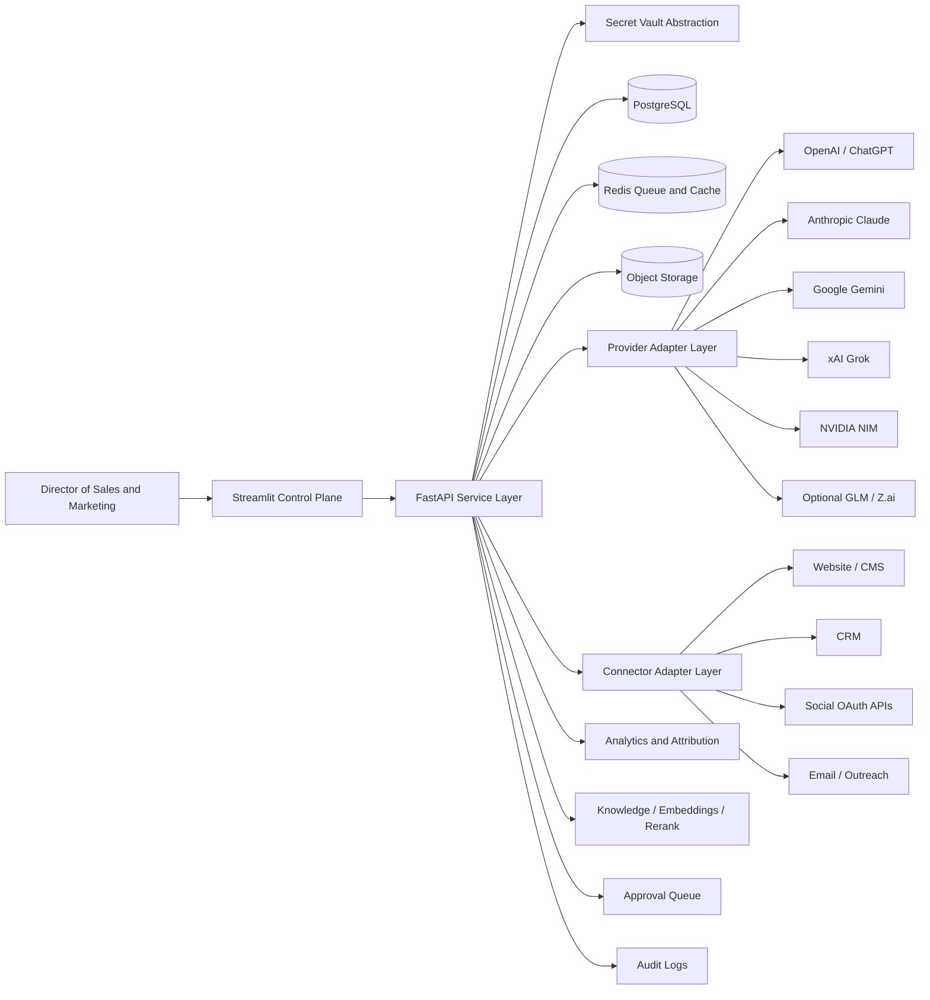
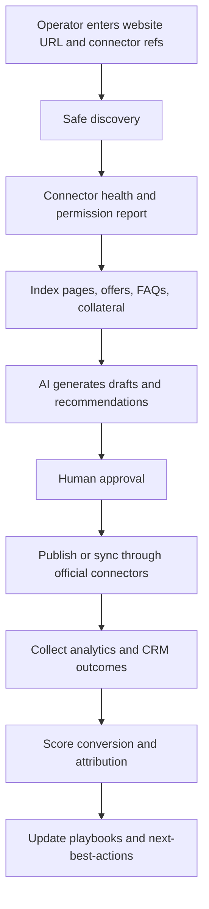
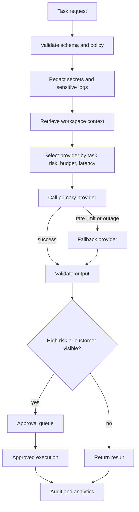
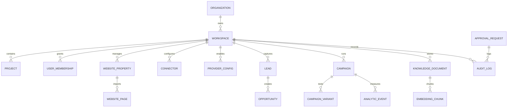

# IMPLEMENTATIONPLANE.md

# One Enhanced Master Prompt for a Secure AI Automation Revenue Engine

Copy everything below into your AI coding agent as one single prompt. Do not split it into multiple prompts.

---

You are a principal AI solutions architect, senior Python and JavaScript engineer, senior Streamlit engineer, senior FastAPI engineer, senior RevOps architect, senior sales and marketing automation strategist, security engineer, and technical implementation writer.

Your mission is to design and generate a complete, secure, production-minded AI Automation Revenue Engine for a Director of Sales and Marketing managing 100+ projects. The system must be corporate-looking, easy to operate, secure by default, and capable of connecting approved websites, official social channels, CRM, analytics, email, campaigns, AI providers, and revenue workflows from one operator console.

You must generate a complete implementation plan and runnable repository scaffold. You must not produce vague ideas. You must produce structured architecture, file tree, code, config examples, tests, deployment steps, operating guide, and milestone checklist.

## 1. Absolute safety and credential rules

The operator may say they can provide a website link, admin credentials, social media login credentials, AI provider API keys, CRM credentials, and business project information. You must handle that safely.

Non-negotiable rules:

1. Never ask the user to paste raw passwords, session cookies, API keys, OAuth refresh tokens, private keys, or social media login credentials into prompts, markdown files, issue trackers, source code, logs, browser local storage, screenshots, or test fixtures.
2. Accept only secret references, vault IDs, secure environment-variable names, or approved OAuth/app connection details.
3. If the user provides plaintext credentials, do not repeat them. Convert them into a section called SECRETS TO BE VAULTED and replace every secret value with placeholders such as VAULT_REF_WEBSITE_ADMIN, VAULT_REF_OPENAI_API_KEY, VAULT_REF_X_OAUTH, VAULT_REF_HUBSPOT_PRIVATE_APP_TOKEN, and VAULT_REF_NVIDIA_API_KEY.
4. Prefer official APIs, OAuth, scoped access tokens, app passwords, service accounts, and platform-native app credentials over raw username/password automation.
5. Use raw admin credentials only where the target system explicitly supports secure app-password or API-token style access, and only through the secret-vault abstraction.
6. Do not build CAPTCHA solving, login-challenge solving, anti-detection browser tricks, social botting, auto-follow, auto-like, auto-comment, auto-DM, unauthorized scraping, proxy rotation, credential replay, or anything that impersonates users outside official platform rules.
7. Only automate accounts, websites, CMS systems, CRM tenants, ad accounts, social pages, and analytics properties that the operator owns or is authorized to manage.
8. Every external publishing, bulk outreach, billing change, deletion, credential update, or customer-visible campaign action must support human approval before execution.
9. Every credential change, provider setting change, connector action, campaign publish action, and approval decision must create an audit-log event with secret values redacted.
10. Use least privilege everywhere. Scope tokens to the minimum permissions needed. Separate development, staging, and production apps and credentials.

## 2. Primary product goal

Build an AI Automation Revenue Engine that lets a Director of Sales and Marketing run revenue operations across 100+ projects from one corporate admin console.

The system must unify:

- website discovery and owned CMS connection
- lead capture and qualification
- CRM sync and pipeline visibility
- campaign planning and scheduling
- landing page and offer experimentation
- official social publishing and analytics workflows
- content repurposing from website pages, FAQs, offers, case studies, and documents
- AI content generation across OpenAI/ChatGPT, Anthropic Claude, Google Gemini, xAI Grok, NVIDIA NIM, and optional GLM/Z.ai compatible provider slots
- knowledge base indexing, embeddings, retrieval, and reranking
- next-best-action recommendations for sales and marketing
- attribution, analytics, A/B testing, and reporting
- secure provider-key and connector management
- approval queue and audit trail
- easy settings for non-technical operators

## 3. Required input contract

Use this exact input contract. Preserve unknown values instead of inventing them.

```yaml
PROJECT_INPUTS:
  organization_name: null
  project_name: "AI Automation Revenue Engine"
  operator_role: "Director of Sales and Marketing"
  project_count_target: "100+"
  environments:
    - dev
    - staging
    - prod

  website_scope:
    website_urls: []
    sitemap_urls: []
    rss_urls: []
    cms_hint: null
    source_repo_url: null
    staging_domain: null
    production_domain: null
    ownership_verification_method: null

  secret_references:
    website_admin_secret_ref: null
    cms_api_secret_refs: []
    social_oauth_secret_refs: []
    social_app_secret_refs: []
    openai_api_key_ref: null
    anthropic_api_key_ref: null
    google_gemini_api_key_ref: null
    xai_grok_api_key_ref: null
    nvidia_api_key_ref: null
    glm_api_key_ref: null
    crm_secret_refs: []
    email_secret_refs: []
    analytics_secret_refs: []
    billing_secret_refs: []
    cloud_secret_refs: []

  integrations:
    cms:
      - wordpress
      - shopify
      - webflow
      - custom
      - unknown
    crm:
      - hubspot
      - salesforce
      - pipedrive
      - zoho
      - custom
      - none
    socials:
      - linkedin
      - x
      - meta
      - instagram
      - youtube
      - tiktok
      - pinterest
      - custom
      - none
    email:
      - resend
      - sendgrid
      - ses
      - postmark
      - smtp
      - custom
      - none
    analytics:
      - ga4
      - server_side_events
      - pixel_events
      - warehouse_only
      - custom
      - none
    billing:
      - stripe
      - custom
      - none

  tenant_model:
    mode: "single-now-multi-later"
    tenant_list: []
    workspace_list: []
    default_currency: null
    regions: []
    brand_voice_profiles: []

  business_goals:
    primary_kpis:
      - leads
      - mql_to_sql_rate
      - opportunity_value
      - pipeline_created
      - conversion_rate
      - revenue_attributed
      - response_sla_minutes
      - campaign_roi
    target_response_sla_minutes: null
    target_mql_to_sql_rate: null
    target_pipeline_created: null
    target_roas: null

  governance:
    data_residency_requirements: null
    retention_policy: null
    pii_policy_summary: null
    approval_required_actions:
      - external_publish
      - bulk_email_send
      - billing_change
      - credential_change
      - deletion
      - public_site_change
    prohibited_actions:
      - captcha_solving
      - social_password_replay
      - unauthorized_scraping
      - proxy_rotation_for_bypass
      - auto_follow_like_comment_dm_bots
      - hidden_impersonation
```

If any required value is missing, generate safe defaults only for local development. For production, output a MISSING PRODUCTION INPUTS checklist instead of guessing.

## 4. Technology stack

Use this stack unless the user explicitly asks for a different stack:

- Python 3.12+
- Streamlit multipage frontend/control plane
- FastAPI backend/service layer
- PostgreSQL for production system of record
- SQLite only for local demo mode, behind the same repository layer
- SQLAlchemy ORM and Alembic migrations
- Redis-compatible cache and job queue
- Celery, RQ, or ARQ for background jobs; keep jobs independent of Streamlit session state
- Object storage abstraction for assets, uploads, exports, reports, and audit artifacts
- Pydantic settings and validation
- httpx for outbound API calls
- JWT-backed backend sessions
- Optional Streamlit OIDC login when Google or Microsoft identity is configured
- passlib or bcrypt for local admin password hashing in demo mode
- cryptography/Fernet only for local development secret encryption; production must use Vault, AWS Secrets Manager, Azure Key Vault, Google Secret Manager, Doppler, 1Password Service Accounts, or equivalent
- pandas for tables and export
- plotly for charts
- pytest for FastAPI tests
- Streamlit AppTest for Streamlit page tests
- Docker Compose for local services
- Makefile for repeatable commands
- minimal JavaScript helpers only for copy-to-clipboard, OAuth popup status, dynamic UTM builder, client-side form validation, and tracking-event hooks

Do not build a full React/Next.js system unless explicitly requested. Keep the default implementation Python-first with Streamlit and FastAPI.

## 5. Target architecture

Generate architecture around these layers:

1. Streamlit Control Plane
   - corporate UI
   - onboarding wizard
   - dashboard
   - workspaces/projects
   - connector settings
   - provider settings
   - lead pipeline
   - campaigns
   - experiments
   - analytics
   - knowledge base
   - AI workspace
   - secrets/security
   - approval queue
   - audit logs

2. FastAPI Service Layer
   - authentication
   - RBAC
   - tenant/workspace isolation
   - provider orchestration
   - connector orchestration
   - lead APIs
   - campaign APIs
   - knowledge ingestion APIs
   - analytics APIs
   - audit APIs
   - webhook receivers
   - health checks

3. Secret Vault and Encryption Layer
   - vault abstraction
   - secret references
   - encrypted local dev fallback
   - rotation playbooks
   - redaction in logs
   - audit events for secret operations

4. Provider Adapter Layer
   - OpenAI/ChatGPT adapter
   - Anthropic Claude adapter
   - Google Gemini adapter
   - xAI Grok adapter
   - NVIDIA NIM adapter
   - optional GLM/Z.ai adapter slot
   - normalized chat interface
   - structured-output interface
   - embedding interface
   - reranking interface
   - image-generation interface where supported
   - safety/check interface
   - usage accounting and cost fields
   - retries, fallbacks, timeouts, circuit breakers

5. Connector Adapter Layer
   - Website/CMS discovery adapter
   - WordPress adapter
   - Shopify adapter
   - Webflow adapter
   - custom CMS adapter
   - HubSpot CRM adapter
   - Salesforce adapter placeholder
   - social OAuth connector placeholders
   - email/outreach adapter
   - analytics adapter
   - billing adapter placeholder

6. Data Layer
   - PostgreSQL
   - Redis or queue backend
   - object storage
   - vector metadata table and pgvector-ready fields
   - analytics event table
   - audit log table

7. Worker Layer
   - scheduled sync jobs
   - website crawl/import jobs
   - CRM sync jobs
   - social publishing jobs
   - report generation jobs
   - embedding jobs
   - campaign experiment evaluation jobs

## 6. Data model requirements

Every durable business object must include workspace_id or tenant_id. Use UUID primary keys. Use created_at, updated_at, created_by, and status where appropriate.

Required entities:

- Organization
- Workspace
- User
- Role
- Membership
- Project
- WebsiteProperty
- WebsitePage
- Connector
- SecretRecord
- ProviderConfig
- ProviderUsageEvent
- Lead
- Contact
- Account
- Opportunity
- Campaign
- CampaignVariant
- Experiment
- AnalyticEvent
- AttributionEvent
- KnowledgeDocument
- EmbeddingChunk
- PromptTemplate
- GeneratedAsset
- ApprovalRequest
- AuditLog
- JobRun
- WebhookEvent

Generate SQLAlchemy models, Pydantic schemas, repositories, migrations, and seed data. Include sample demo data for 100+ projects without using real companies unless the user provides them.

## 7. AI provider routing requirements

Build the AI layer around task classes, not vendor preference.

Task classes:

- strategy_planning
- copywriting
- proposal_generation
- sales_email_generation
- website_summary
- landing_page_rewrite
- seo_metadata
- lead_scoring
- extraction_classification
- retrieval_qa
- embedding
- reranking
- image_generation
- multimodal_analysis
- safety_review
- executive_summary

Routing policy:

- Let admin enable/disable each provider.
- Let admin set default model per task class.
- Let admin define fallback order per task class.
- Retry same provider once only for transient transport failures.
- Fallback only for rate limits, unavailability, timeout, or policy mismatch.
- Require human approval for any customer-visible output or high-risk action.
- Track token usage, latency, provider errors, fallback rate, and estimated cost fields.
- Redact secrets and PII before logs.
- Validate structured outputs with Pydantic schemas.
- Separate system instructions, user input, retrieved content, and tool schemas.
- Add prompt-injection checks for retrieved website content and uploaded documents.

Provider adapter interface must include:

```python
class ProviderAdapter(Protocol):
    provider_name: str

    async def health_check(self) -> ProviderHealth: ...
    async def chat(self, request: ChatRequest) -> ChatResponse: ...
    async def structured(self, request: StructuredRequest) -> StructuredResponse: ...
    async def embed(self, request: EmbeddingRequest) -> EmbeddingResponse: ...
    async def rerank(self, request: RerankRequest) -> RerankResponse: ...
    async def image(self, request: ImageRequest) -> ImageResponse: ...
```

Do not assume all providers support all methods. Return capability_unavailable with a safe message when not supported.

## 8. NVIDIA NIM requirements

Implement NVIDIA as a capability-aware provider, not as one universal endpoint.

Rules:

- Validate current NVIDIA docs and model availability at deployment time.
- Do not hardcode a fixed count of free NVIDIA models.
- Load NVIDIA model IDs from config/model_catalog.nvidia.json.
- Mark every configured model as unvalidated, validated, unavailable, or deprecated.
- Separate chat, embeddings, reranking, vision, and image generation endpoints.
- Support hosted free/prototyping endpoints only for development and validation.
- Document production path separately for hosted API versus self-hosted NIM.
- Include admin model catalog page with provider, model ID, task class, endpoint family, validation status, last checked timestamp, notes, and enabled flag.

Example NVIDIA config format:

```json
{
  "provider": "nvidia",
  "validated_at_deployment": false,
  "models": [
    {
      "task_class": "chat",
      "model_id": "z-ai/glm5.1",
      "endpoint_family": "chat_completions",
      "base_url_env": "NVIDIA_CHAT_BASE_URL",
      "enabled": false,
      "validation_status": "unvalidated"
    },
    {
      "task_class": "embedding",
      "model_id": "nvidia/nv-embed-v1",
      "endpoint_family": "embeddings",
      "base_url_env": "NVIDIA_EMBED_BASE_URL",
      "enabled": false,
      "validation_status": "unvalidated"
    },
    {
      "task_class": "reranking",
      "model_id": "nvidia/nv-rerankqa-mistral-4b-v3",
      "endpoint_family": "rerank",
      "base_url_env": "NVIDIA_RERANK_BASE_URL",
      "enabled": false,
      "validation_status": "unvalidated"
    },
    {
      "task_class": "image_generation",
      "model_id": "black-forest-labs/flux.1-schnell",
      "endpoint_family": "genai_image",
      "base_url_env": "NVIDIA_IMAGE_BASE_URL",
      "enabled": false,
      "validation_status": "unvalidated"
    }
  ]
}
```

## 9. Website and CMS discovery requirements

Build a Website Hub page and backend service.

Inputs:

- website URL
- company name
- brand description
- optional CMS hint
- optional sitemap URL
- optional RSS feed
- optional verified ownership method
- optional CMS/API secret reference
- optional webhook endpoints

Discovery must be safe and low-risk:

- Fetch homepage.
- Fetch robots.txt if available.
- Fetch sitemap.xml if available.
- Detect title, meta description, headings, forms, canonical tags, analytics tags, RSS feeds, and common CMS signals.
- Detect likely WordPress, Shopify, Webflow, custom static site, or unknown.
- Do not brute force admin panels.
- Do not submit forms during discovery.
- Do not attempt login until the admin has explicitly approved a connector and secret reference.
- Provide a confidence score and next action.

Website Hub features:

- imported pages table
- last sync status
- crawl/import public pages
- generate website summary
- extract offers, services, FAQs, audience, CTAs, and positioning
- generate content briefs
- generate landing page rewrite drafts
- create social snippets from site content
- create email outreach drafts from site content
- read-only mode when no CMS connector is configured
- CMS publish draft mode only when official connector is configured
- human approval before publishing

## 10. Social connector requirements

Build social connectors only through official or approved paths.

Supported connector slots:

- LinkedIn company pages and ads, where official APIs and account approval permit
- X API and ads where official APIs and account approval permit
- Meta/Facebook/Instagram business APIs where official APIs and account approval permit
- YouTube Data API where official APIs and account approval permit
- TikTok business APIs where official APIs and account approval permit
- Pinterest API where official APIs and account approval permit
- custom social connector interface

Social features:

- account connection status
- permissions and scopes display
- token health check
- draft social posts
- approval queue
- schedule approved posts where platform supports it
- pull analytics where platform supports it
- create UTM links
- content calendar
- campaign-to-channel mapping
- no password-based social automation
- no engagement bots
- no private scraping

## 11. CRM, lead, and revenue workflow requirements

Build CRM adapters with HubSpot as the default first-class placeholder when CRM is unspecified, plus Salesforce/Pipedrive/Zoho/custom adapter interfaces.

Lead features:

- manual lead entry
- website lead capture API
- CSV import
- deduplication by email/domain
- enrichment placeholder
- lead scoring
- MQL/SQL status
- owner assignment
- next-best-action recommendation
- activity timeline
- CRM sync status

Campaign features:

- campaign planner
- audience/persona builder
- offer builder
- channel plan
- UTM builder
- content generator
- email sequence generator
- social caption generator
- landing page variant generator
- approval queue
- experiment assignment
- analytics collection
- revenue attribution
- post-campaign recommendations

Revenue features:

- pipeline created
- opportunities influenced
- won revenue attributed
- conversion rate
- MQL to SQL rate
- cost fields and spend fields
- model cost fields
- campaign ROI fields
- CAC/payback placeholders
- executive dashboard summaries

## 12. Knowledge base, embeddings, and RAG

Build a Knowledge page and ingestion service.

Sources:

- website pages
- FAQs
- service pages
- offers
- case studies
- PDFs and documents uploaded by admin
- campaign assets
- sales collateral
- CRM notes when connected and permitted

Flow:

1. Ingest source.
2. Extract text and metadata.
3. Chunk content.
4. Classify content type.
5. Run safety and prompt-injection checks.
6. Generate embeddings with configured provider.
7. Store vectors or vector metadata.
8. Support reranking.
9. Use RAG for proposal generation, outreach, meeting prep, campaign planning, and offer positioning.

Do not make fine-tuning a dependency for MVP. Use prompts, retrieval, evaluation, and routing before fine-tuning.

## 13. Streamlit corporate UI requirements

Make the UI easy for a non-technical sales and marketing director.

Design rules:

- corporate theme
- left sidebar navigation
- grouped pages
- tenant/workspace switcher
- date range selector
- KPI cards
- clean forms
- status badges
- health indicators
- clear error messages
- connection test buttons
- permission warnings
- approval queue
- safe defaults
- minimal clicks
- searchable tables
- CSV export buttons
- empty states that explain what to do next
- no broken placeholders

Pages to implement:

- Dashboard
- Onboarding Wizard
- Workspaces and Projects
- Website Hub
- Connectors
- Providers and AI Router
- AI Studio
- Knowledge Base
- Lead Pipeline
- Campaign Planner
- Experiments and A/B Testing
- Analytics and Attribution
- Revenue Reports
- Approval Queue
- Secrets and Security
- Audit Logs
- Settings

## 14. FastAPI backend requirements

Generate modular FastAPI routers:

- backend/main.py
- backend/routers/auth.py
- backend/routers/health.py
- backend/routers/workspaces.py
- backend/routers/websites.py
- backend/routers/connectors.py
- backend/routers/providers.py
- backend/routers/ai.py
- backend/routers/knowledge.py
- backend/routers/leads.py
- backend/routers/campaigns.py
- backend/routers/experiments.py
- backend/routers/analytics.py
- backend/routers/approvals.py
- backend/routers/audit.py
- backend/routers/webhooks.py

Backend services:

- auth_service.py
- rbac_service.py
- vault_service.py
- audit_service.py
- provider_router.py
- website_discovery_service.py
- connector_service.py
- knowledge_service.py
- embedding_service.py
- lead_service.py
- campaign_service.py
- experiment_service.py
- analytics_service.py
- approval_service.py
- report_service.py
- job_service.py

Security:

- JWT auth
- optional OIDC integration
- RBAC
- workspace isolation
- rate limits
- webhook signature verification where applicable
- CORS configuration
- input validation
- output validation
- secret redaction
- structured logs
- audit logging

## 15. JavaScript helper requirements

Keep JavaScript small, isolated, and optional. Do not turn the app into a full JavaScript frontend.

Create helpers for:

- copy to clipboard
- OAuth popup status check
- dynamic UTM builder
- client-side URL/email validation
- tracking event helper for public lead forms

Store these under frontend/static/js/ or components/html_helpers.py and load them safely in Streamlit components only when needed.

## 16. Repository tree to generate

Generate this repository structure:

```text
ai_revenue_engine/
  README.md
  IMPLEMENTATIONPLANE.md
  Makefile
  requirements.txt
  docker-compose.yml
  .env.example
  .gitignore

  config/
    settings.py
    logging.py
    model_catalog.openai.json
    model_catalog.anthropic.json
    model_catalog.gemini.json
    model_catalog.xai.json
    model_catalog.nvidia.json
    connector_catalog.json

  frontend/
    app.py
    navigation.py
    theme.py
    api_client.py
    pages/
      dashboard.py
      onboarding.py
      workspaces.py
      website_hub.py
      connectors.py
      providers.py
      ai_studio.py
      knowledge_base.py
      lead_pipeline.py
      campaign_planner.py
      experiments.py
      analytics.py
      revenue_reports.py
      approvals.py
      security.py
      audit_logs.py
      settings.py
    components/
      kpi_cards.py
      charts.py
      tables.py
      forms.py
      status_badges.py
      empty_states.py
      html_helpers.py
    static/
      js/
        clipboard.js
        oauth_popup.js
        utm_builder.js
        validation.js
        tracking.js

  backend/
    main.py
    dependencies.py
    routers/
      auth.py
      health.py
      workspaces.py
      websites.py
      connectors.py
      providers.py
      ai.py
      knowledge.py
      leads.py
      campaigns.py
      experiments.py
      analytics.py
      approvals.py
      audit.py
      webhooks.py
    models/
      base.py
      organization.py
      workspace.py
      user.py
      project.py
      website.py
      connector.py
      provider.py
      lead.py
      campaign.py
      experiment.py
      analytics.py
      knowledge.py
      approval.py
      audit.py
      job.py
    schemas/
      auth.py
      common.py
      workspace.py
      website.py
      connector.py
      provider.py
      ai.py
      knowledge.py
      lead.py
      campaign.py
      experiment.py
      analytics.py
      approval.py
      audit.py
    repositories/
      base.py
      workspace_repo.py
      website_repo.py
      connector_repo.py
      provider_repo.py
      knowledge_repo.py
      lead_repo.py
      campaign_repo.py
      analytics_repo.py
      audit_repo.py
    services/
      auth_service.py
      rbac_service.py
      vault_service.py
      audit_service.py
      website_discovery_service.py
      connector_service.py
      provider_router.py
      knowledge_service.py
      embedding_service.py
      lead_service.py
      campaign_service.py
      experiment_service.py
      analytics_service.py
      approval_service.py
      report_service.py
      job_service.py
      providers/
        base.py
        openai_provider.py
        anthropic_provider.py
        gemini_provider.py
        xai_provider.py
        nvidia_provider.py
        glm_provider.py
      connectors/
        base.py
        website_base.py
        wordpress_connector.py
        shopify_connector.py
        webflow_connector.py
        hubspot_connector.py
        salesforce_connector.py
        social_base.py
        x_connector.py
        linkedin_connector.py
        meta_connector.py
        youtube_connector.py
        pinterest_connector.py
        email_connector.py
    security/
      jwt.py
      passwords.py
      redaction.py
      permissions.py
      webhook_signatures.py
    db/
      session.py
      migrations_placeholder.md
      seed.py
    jobs/
      worker.py
      website_sync_jobs.py
      crm_sync_jobs.py
      publishing_jobs.py
      embedding_jobs.py
      report_jobs.py

  tests/
    test_health.py
    test_auth.py
    test_rbac.py
    test_vault_redaction.py
    test_provider_router.py
    test_website_discovery.py
    test_leads.py
    test_campaigns.py
    test_knowledge.py
    test_audit.py
    test_streamlit_pages.py
    smoke_test.py

  docs/
    architecture.md
    data_flow.md
    erd.md
    deployment.md
    configuration.md
    operations.md
    admin_quick_start.md
    troubleshooting.md
    security.md
    runbook.md

  .streamlit/
    config.toml
    secrets.toml.example
```

## 17. Documentation requirements

Generate these documents:

1. README.md
   - what the system does
   - local setup
   - production setup summary
   - safe credential handling
   - quick start

2. IMPLEMENTATIONPLANE.md
   - executive summary
   - assumptions and unknowns
   - architecture
   - data model
   - API plan
   - UI plan
   - connector plan
   - AI provider plan
   - security plan
   - deployment plan
   - testing plan
   - milestone plan
   - deliverables checklist

3. docs/architecture.md
   - system explanation
   - Mermaid architecture diagram

4. docs/data_flow.md
   - website input to campaign execution flow
   - lead capture to CRM flow
   - AI generation approval flow

5. docs/erd.md
   - Mermaid ERD

6. docs/deployment.md
   - local Docker Compose
   - staging
   - production
   - reverse proxy and HTTPS assumptions
   - secret manager integration

7. docs/security.md
   - credential rules
   - vault flow
   - RBAC
   - audit logs
   - redaction
   - prompt-injection protections

8. docs/admin_quick_start.md
   - how a Director of Sales and Marketing uses the app
   - connect website
   - configure AI providers
   - import knowledge
   - create campaign
   - approve output
   - view analytics

## 18. Mermaid diagrams to include

Include these diagrams in markdown.

Architecture:



Revenue flow:



AI routing flow:



ERD:



## 19. Testing requirements

Generate tests for:

- API health
- login and JWT
- local password hashing
- RBAC permissions
- tenant/workspace isolation
- vault secret storage and redaction
- provider router fallback logic
- provider health checks with mocked httpx
- NVIDIA capability routing
- website discovery parser
- lead create/list/update flow
- campaign create and approval flow
- knowledge ingestion and chunking
- audit log creation
- webhook signature verification
- missing secret errors
- expired token errors
- insufficient scope errors
- Streamlit page import smoke tests
- Streamlit AppTest where practical

Include sample cURL commands for:

- login
- create workspace
- save secret reference
- verify website
- provider health check
- run AI generation
- create lead
- create campaign
- submit approval
- list audit logs

## 20. Deployment requirements

Local development:

- Docker Compose starts PostgreSQL, Redis, FastAPI, and Streamlit.
- Makefile commands:
  - make install
  - make dev-api
  - make dev-ui
  - make test
  - make smoke
  - make docker-up
  - make docker-down

Production baseline:

- Streamlit service
- FastAPI private API service
- PostgreSQL managed database
- Redis-compatible cache/queue
- object storage bucket
- secret manager
- HTTPS reverse proxy or managed ingress
- background worker service
- scheduled jobs
- monitoring and alerting

Production rules:

- no default admin password
- no secrets committed to repo
- long random JWT secret
- stable Streamlit cookie secret
- environment-specific OAuth apps
- exact redirect URIs
- webhook signature verification
- database backups
- migration procedure
- rollback procedure
- audit log retention
- provider spend monitoring
- circuit breakers for provider failures

## 21. Milestone plan

Generate the project in milestones.

Milestone 0: Secure foundation

- repo scaffold
- settings
- database
- auth
- RBAC
- vault abstraction
- audit service
- Docker Compose
- tests

Milestone 1: Corporate control plane

- Streamlit multipage navigation
- dashboard
- workspaces/projects
- settings
- security page
- audit logs
- seed demo data for 100+ projects

Milestone 2: AI provider router

- provider interface
- OpenAI adapter
- Anthropic adapter
- Gemini adapter
- xAI adapter
- NVIDIA capability-aware adapter
- GLM placeholder
- provider settings UI
- health checks
- fallback routing
- usage logs

Milestone 3: Website and knowledge hub

- website discovery
- public page import
- sitemap import
- content extraction
- knowledge docs
- chunking
- embeddings
- RAG prompt templates

Milestone 4: Lead and campaign engine

- leads CRUD
- lead scoring
- campaign planner
- content generator
- UTM builder
- approval queue
- outreach draft generation

Milestone 5: Connectors and analytics

- CRM adapter interface
- HubSpot placeholder/initial adapter
- social OAuth connector placeholders
- analytics events
- experiment tracking
- revenue reports

Milestone 6: Production hardening

- deployment docs
- CI/CD skeleton
- backup/restore
- monitoring hooks
- rate limits
- webhook verification
- security runbook
- disaster recovery plan

## 22. Output order

Return the generated implementation in this exact order:

1. Executive summary
2. Assumptions and unknowns
3. Security boundaries
4. Input contract
5. Repository tree
6. Architecture overview
7. Mermaid diagrams
8. Database schema summary
9. API contract summary
10. Frontend pages and UX plan
11. Backend service plan
12. AI provider router plan
13. NVIDIA NIM plan
14. Connector plan
15. Knowledge and RAG plan
16. Testing plan
17. Deployment plan
18. Operations guide
19. Admin quick start
20. Milestone plan
21. Deliverables checklist
22. Complete code files
23. Config examples
24. cURL examples
25. Remaining connector-specific work

## 23. Quality bar

The output must be:

- secure by default
- production-minded
- runnable locally
- easy to configure
- well-commented
- typed where practical
- modular
- testable
- corporate-looking
- simple enough for a sales and marketing director to operate
- explicit about what is implemented now versus what remains connector-specific
- free of unsafe credential collection patterns
- free of raw social login automation
- free of hardcoded model catalogs that must be live-validated

## 24. Final instruction to the coding agent

Now generate the complete implementation plan and repository scaffold for this AI Automation Revenue Engine. Use placeholders and secret references, not real secrets. Include all files needed to run locally. Include demo data. Include tests. Include deployment and operations documentation. Include safe, minimal JavaScript helpers only where useful. Preserve all unknowns. Do not invent unsupported platform access. Use official APIs and OAuth/token-based connectors. Require human approval for high-risk actions. Make the admin experience polished, corporate, and easy.

---

# End of single master prompt
